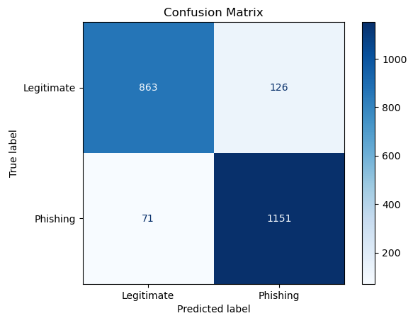
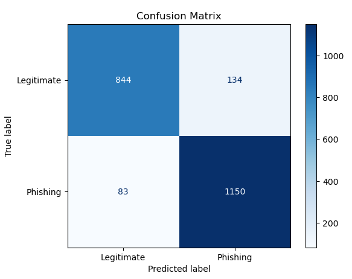

# Phishing Website Classification using Bernoulli Naive Bayes Classification

The notebook was created using the 05.05 Naive Bayes notebook available in the [Python Data Science Handbook Github Repository](https://github.com/jakevdp/PythonDataScienceHandbook).

The following website was also used in making this notebook: [BAIT 509](https://bait509-ubc.github.io/BAIT509/lectures/lecture6.html)

This repository contains a [Jupyter](https://jupyter.org/) Notebook for the training of a [Bernoulli Naive Bayes Classifier model](https://scikit-learn.org/stable/modules/naive_bayes.html#bernoulli-naive-bayes) for detecting whether a website is phishing or legitimate.

### Libraries

- [Pandas](https://pandas.pydata.org/) — Loading data
- [Scikit Learn](https://scikit-learn.org/stable/) — Loading data, training model
- [Matplotlib Pyplot](https://matplotlib.org/stable/) — Visualising results
- [Pickle](https://docs.python.org/3/library/pickle.html) — Saving and loading model
- [Numpy](https://numpy.org/) — Processing data

### Data

The data for the websties both phishing and legitimate was downloaded from [UC Irvine Machine Learning Repository](https://archive.ics.uci.edu/dataset/327/phishing+websites).

Overall there are 29 features for each entry in the ARFF file that describe the websites used to classify them, and around 11 thousand entries for different websites both phishing and legitimate. The exact names and domains of websites is not given in the data set though. An explanation of the features of the data set is available in the [DOCX file](phishing_websites_data/Phishing%20Websites%20Features.docx) provided with the data.

### Process

The following procedure is used in the Jupyter Notebook ([Ipynb](Notebooks/naive_bayes_phishing_classification.ipynb), [PDF](Notebooks/naive_bayes_phishing_classification.pdf)) to process and visualise the data:

1. The data from the ARFF file is imported, and cleaned up by removeing the 'b' in values and adding 1 to each value as the data is represented as -1 in some cases but the model does not work with negative values.
2. The data set is split into 60% training, 20% validation, and 20% test sets.
3. A **BernoulliNB** model is created and trained on the training data set.
4. The trained model gives back an accuracy of 91%. The model gives more false **phishing** classifications than false **legitimate** ones, which is much better as it is better to be cautious on a legitimate website than have the model give loads of legitimate classifications to phishing websites.

   _Confusion Matrix for BernoulliNB:_  
   

5. Next some hyperparameter tuning was done using the GridSearchCV method, however the results for this negligable as they didn't change the score of the model much.
6. The model then got tested with the **test** set giving 90% accuracy.

   _Confusion Matrix for BernoulliNB:_  
   

7. The model is then saved using **pickle** and loaded back up to be able to be used for classifying new websites, where the user is asked a series of questions on the website.

### Further Work

One of the big downsides of this model is that some of the questions asked by the program about the website are a bit technical. A further improvement of this program would be to create accompanying Python scripts which would be able to look at the website and automate quite a few of the data collection about a website.
